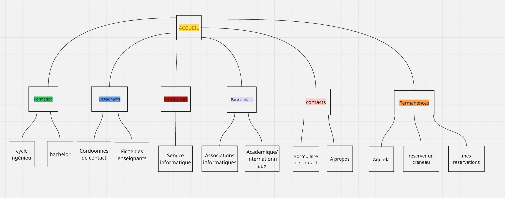

# Projet TI402 — Site web Département Informatique EFREI

Projet réalisé par Alain Periassamy et Nassim Bouazza dans le cadre du module TI402, classe P2 SC4, promotion 2025-2026, sous la direction de M. Hamidi.

## À propos du projet

Site web de présentation du département informatique de l'EFREI Paris. Il comprend plusieurs sections : les formations proposées, le corps enseignant, la vie étudiante, les partenariats, un système de permanences et un formulaire de contact.

Le site a été développé entièrement en HTML, CSS et JavaScript, sans framework ni bibliothèque externe.

## Équipe

- **Alain Periassamy** — CSS, page d'accueil, formations, carousel, responsive
- **Nassim Bouazza** — enseignants, vie étudiante, partenariats, contact, permanences, JavaScript

## Maquette

## Dépôt GitHub

https://github.com/alain192006/PERIASSAMY_BOUAZZA
